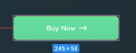
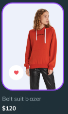

# Figma

## Praktikum
Analisis desain dari: [Link Figma](https://www.figma.com/file/Tk4c9OwKIjylGkhp0qtyss/Tugas-Prototype)

1. Button\

- warna dalam satuan RGB: rgb(255,255,255)
- Shadow-nya menggunakan: Drop shadow
- background: linear-gradient(180deg, #40DF9F 0%, #3ED598 100%);
- box-shadow: 0px 2px 4px 0px rgba(15, 218, 137, 0.3)
- border-radius: 12px

2. Card\

- Width: 150px
- Height: 210px
- Radius: 25px

## Summary
Selama belajar materi Figma, saya dapat memahami:
- Figma merupakan editor grafik vektor dan alat prototyping yang menggunakan basis web.
- Kelebihan dan kekurangan Figma
- Cara mendesain sebuah web di Figma.
- Cara membuat sebuah frame dan grid di Figma.
- Cara menyimpan color style yang akan digunakan di Figma.
- Cara melakukan import foto ke Figma.
- Cara cembuat auto layout di Figma.
- Cara membuat komponen di Figma.
- Cara membuat element yang bisa di-scroll di Figma.
- Cara membuat fixed element di Figma.
- Cara membuat hover state di Figma.
- Cara Menambahkan overlay di Figma.
- Cara membuat prototype di Figma