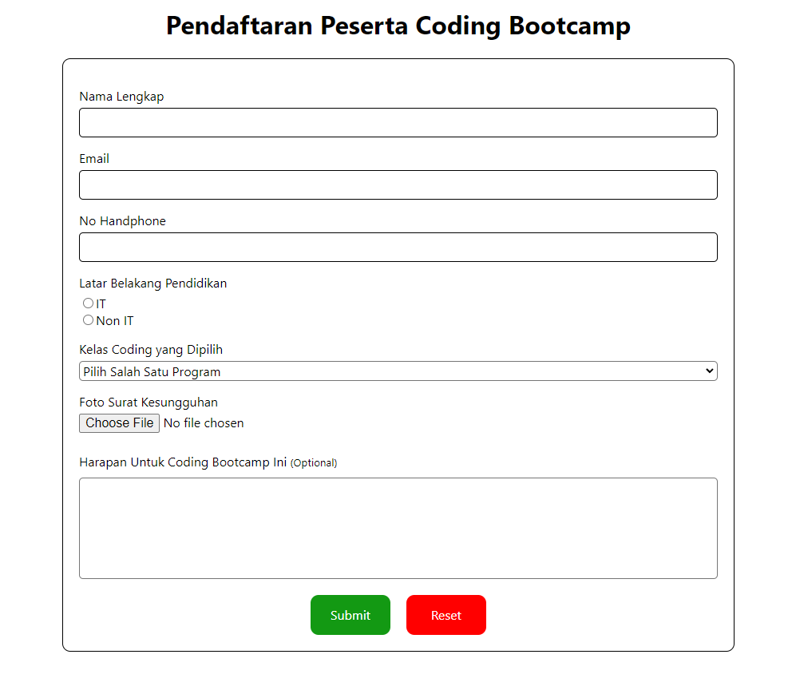
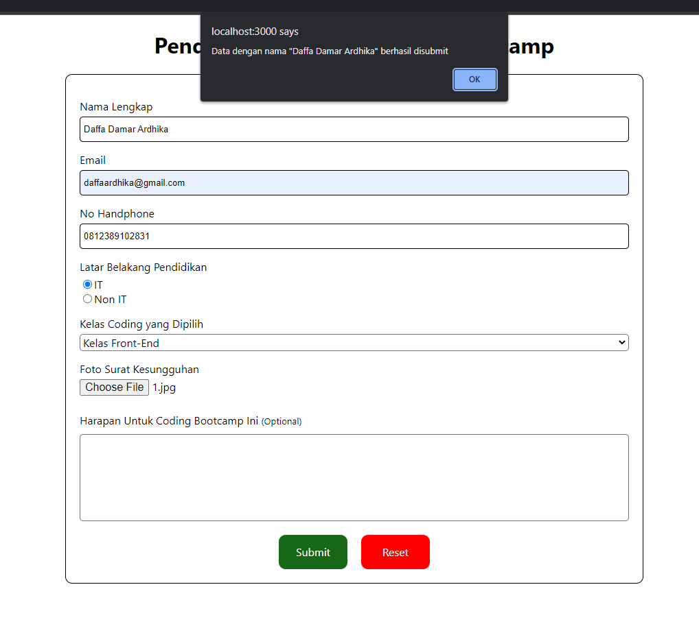
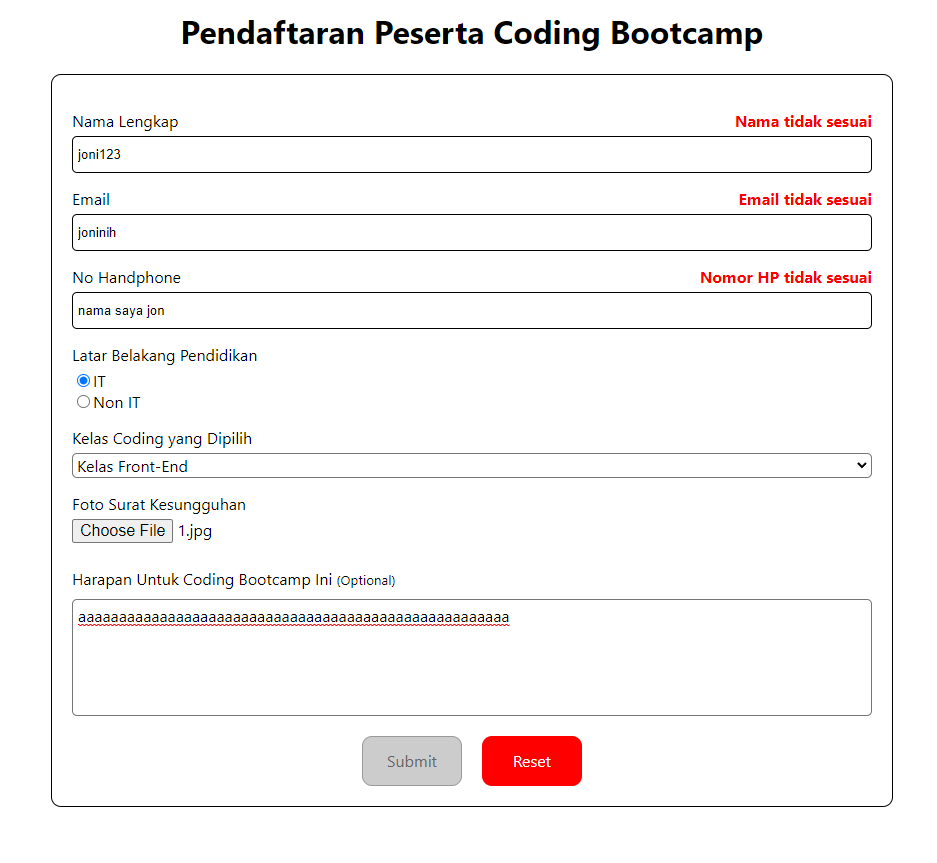

# React Form

## Summary
- Form merupakan elemen pada HTML yang dapat menangani input dari user. Biasa dijumpai pada saat login, sign-up, upload file.
- Jenis input yang biasa digunakan pada form: text, email, password, number, select, radio, checkbox, button, file.
- Controlled component pada react merupakan sebuah component yang dikontrol ketika ada perubahan. Dengan menggunakan controlled component, validasi dapat dilakukan sebelum user melakukan submit.
- Uncontrolled component pada react merupakan sebuah component yang tidak terkontrol ketika ada perubahan. Uncontrolled component digunakan ketika input hanya dibutuhkan sekali saja. Dengan menggunakan uncontrolled component, validasi dilakukan setelah user melakukan submit.
- Ada dua tipe validasi: Validasi client side dan validasi server side

### Uncontrolled vs Controlled
|feature |	uncontrolled | controlled |
|--------|---------------|------------|
|one-time value retrieval (e.g. on submit)	|✅	|✅
|validating on submit	|✅|	✅
|instant field validation	|❌	|✅
|conditionally disabling submit button|	❌|✅
|enforcing input format|❌|	✅
|several inputs for one piece of data	|❌|	✅
|dynamic inputs	|❌|	✅

## Praktikum
1. Tampilan Utama Form

2. Form ketika disubmit dan sesuai

2. Form ketika tidak valid
