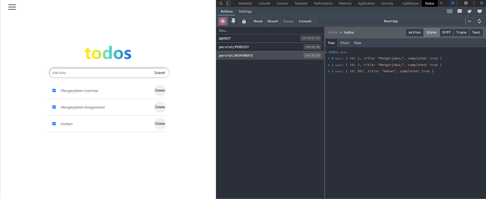

## Summary
- Global state merupakan state yang bisa dipakai semua komponen aplikasi React.
- Global state dibutuhkan ketika state dibutuhkan di banyak tempat.
- Redux merupakan global state management yang dibuat untuk aplikasi berbasis javascript yang mana bisa digunakan di react, vue, angular, dll.
- Redux terdiri dari 3 bagian utama, yaitu Actions, Reducer, dan Store.
- Persisted state merupakan cara menyimpan setiap perubahan state ke dalam local storage agar perubahan yang dibuat tidak hilang ketika page di-reload.
- Data fetching merupakan cara untuk mendapatkan data dari backend.
- Beberapa cara mendapatkan data fetching dari API: Menggunakan fetch yang tersedia pada vanilla js, menggunakan axios.
- Beberapa method pada data fetching: GET, POST, PATCH, PUT, DELETE.

#### Hasil Praktikum Global State
- Redux

- Persist state

#### Hasil Praktikum Data Fetching
- Fetch Todos

- Create Todo

- Update Todo

- Fetch Todos

