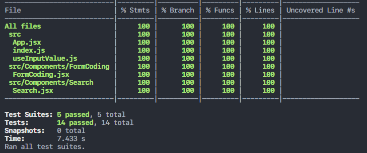
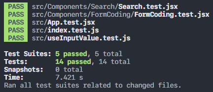

## Summary
- Testing merupakan proses memverifikasi bahwa test assertions benar dan bahwa code kita tetap benar sepanjang masa aplikasi.
- Test assertion merupakan ekpresi boolean yang mengembalikan nilai true kecuali ada bug di kode.
- Dengan melakuakn testing, aplikasi menjadi less bug. Walaupun testing tidak menjamin aplikasi menjadi bebas bug, tetapi testing dapat mencegah beberapa hal yang berpotensi menjadi bug
- Secara umum, ada 2 cara mengetes React: Rendering component trees dan end-to-end test
- Tools yang direkomendasikan dalam mengetes aplikasi react adalah menggunakan Jest.
- RTL (React Testing Library) merupakan seperangkat helpers yang memungkinkan kita mengetes komponen pada React tanpa bergantung pada detail impletentasinya. 
- Dengan pengekatan RTL, refactoring menjadi mudah dan juga mendorong developer untuk menerapkan best practices untuk aksesibilitas.
- React Testing Library digunakan untuk berinteraksi dengan komponen seperti selayaknya manusia.

#### Contoh Testing
Kode yang ingin dites
```javascript
//math.js
function sum(x,y) {
  return x + y;
}
```
Testing yang dilakukan
```javascript
import sum from './math.js'

describe('sum', () => {
  test('sums uo two values', () => {
    expect(sum(2,4)).toBe(6)
  });
});
```
### Screenshot praktikum
Coverage testing

Testing
