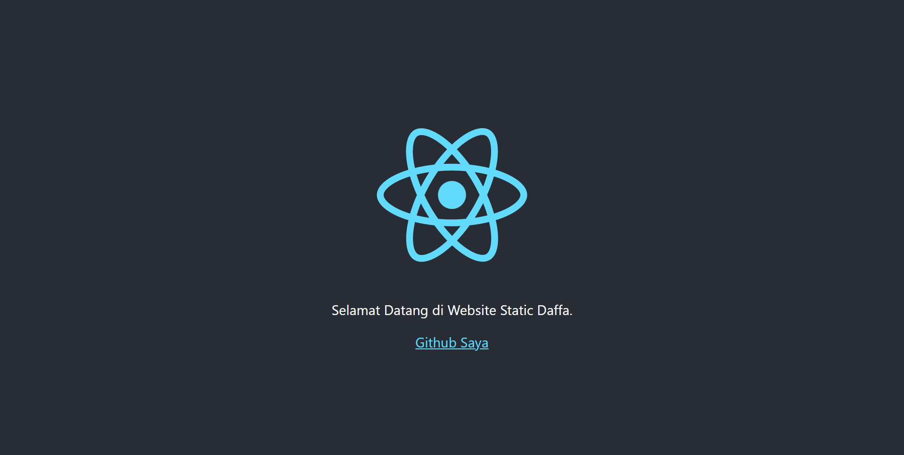

## Summary
- Secara default, React mengandung banyak pesan peringatan yang dapat berguna dalam pengembangan aplikasi. Namun, pesan-pesan ini membuat React menjadi lebih besar dan lambat, maka harus menggunakan versi production ketika melakukan deploy aplikasi. Tujuan melakukan build ini adalah agar aplikasi menjadi versi production, sehingga performanya lebih ringan dan cepat.
- Cara melakukan build React App: Mengetikan perintah `npm run build` di terminal folder masing-masing. Perintah ini akan membuat versi production untuk aplikasi yang terdapat di dalam folder bernama build.
- Deployment merupakan kegiatan yang bertujuan untuk menyebarkan aplikasi yang sudah dibuat dengan harapan aplikasi tersebut dapat diakses oleh banyak orang.
- Ada banyak platform untuk mendeploy React App. Salah satunya adalah Netlify.
- Netlify merupakan salah satu platform penyedia layanan build tools sekaligus Continous Deployment. Netlify memungkinkan untuk melakukan publish website statis secara gratis. Netlify juga sudah terintegrasi dengan Git Host popular seperti Github, Gitlab, dan Bitbucket

### Hasil Essay
Link Deploy Project React: https://taskdeploy-daffadamarardhika.netlify.app
#### Screenshot
