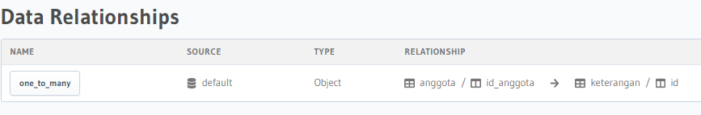
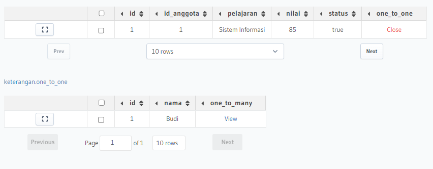
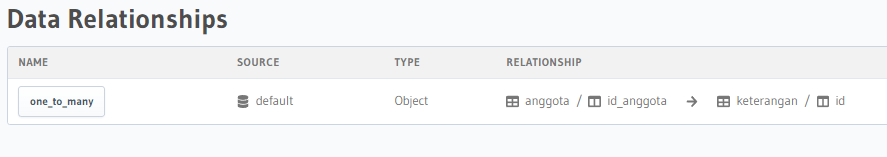
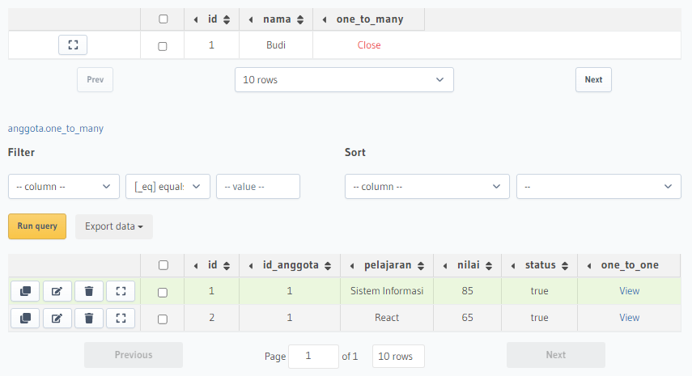

## Summary
- Database relasional adalah kumpulan item data dengan hubungan yang telah ditentukan sebelumnya. 
- Berbagai item disusun menjadi satu set tabel dengan kolom dan baris. 
- Tabel digunakan untuk menyimpan informasi tentang objek yang akan direpresentasikan dalam database. 
- Tiap kolom pada tabel memuat jenis data tertentu dan bidang menyimpan nilai aktual atribut. 
- Baris pada tabel merepresentasikan kumpulan nilai terkait dari satu objek atau entitas. 
- Tiap baris pada tabel dapat ditandai dengan pengidentifikasi unik yang disebut primary key, dan baris di antara beberapa tabel dapat dibuat saling terkait menggunakan foreign key.

#### Relasi dalam Database
1. Relasi One-to-One
Relasi One-to-One adalah relasi dimana suatu baris tabel A hanya berhubungan dengan suatu baris tabel B.

2. Relasi One-to-Many
Relasi One-to-Many adalah relasi dimana suatu baris di table A memiliki relasi di beberapa baris di table B.

3. Relasi Many-to-Many
Relasi Many-to-Many adalah relasi dimana setiap lebih dari satu baris data dari tabel A berhubungan dengan lebih dari satu baris data pada tabel B. Artinya, kedua tabel masing-masing dapat mengakses banyak data dari tabel yang direlasikan. Maka dari itu, relasi Many to Many butuh tabel C sebagai perantara tabel A dan tabel B.

#### Perintah dalam SQL
1. DDL
DDL atau Data Definition Language merupakan perintah SQL yang berhubungan dengan pendefinisian suatu struktur database. Apa saja yang menggunakan DDL: 
- CREATE: 
CREATE DATABASE
CREATE FUNCTION
CREATE INDEX
CREATE PROCEDURE
CREATE TRIGGER
CREATE VIEW
CREATE TABLE

- RENAME:
RENAME TABLE

- ALTER:
ALTER DATABASE
ALTER FUNCTION
ALTER PROCEDURE
ALTER TABLE
ALTER VIEW

- DROP:
DROP DATABASE
DROP FUNCTION
DROP INDEX
DROP PROCEDURE
DROP TABLE
DROP TRIGGER
DROP VIEW

2. DML
DML atau Data Manipulation Language merupakan perintah SQL yang berhubungan dengan manipulasi atau pengolahan data dalam table. Yang menggunakan DML:
- SELECT
- INSERT
- UPDATE
- DELETE

3. DCL
DCL atau Data Control Language, biasa digunakan untuk merubah hak akses, memberikan roles, dan isu lain yang berhubungan dengan keamanan database. Yang menggunakan DCL:
- GRANT
GRANT SELECT
GRANT UPDATE
GRANT INSERT
GRANT DELETE
- REVOKE
REVOKE SELECT
REVOKE DELETE
REVOKE INSERT
REVOKE UPDATE

#### Hasil Praktikum
Relasi one-to-one

Hasil relasi one-to-one

Relasi one-to-many

Hasil relasi one-to-many
