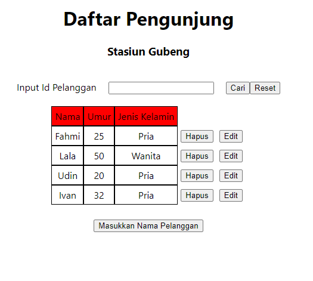
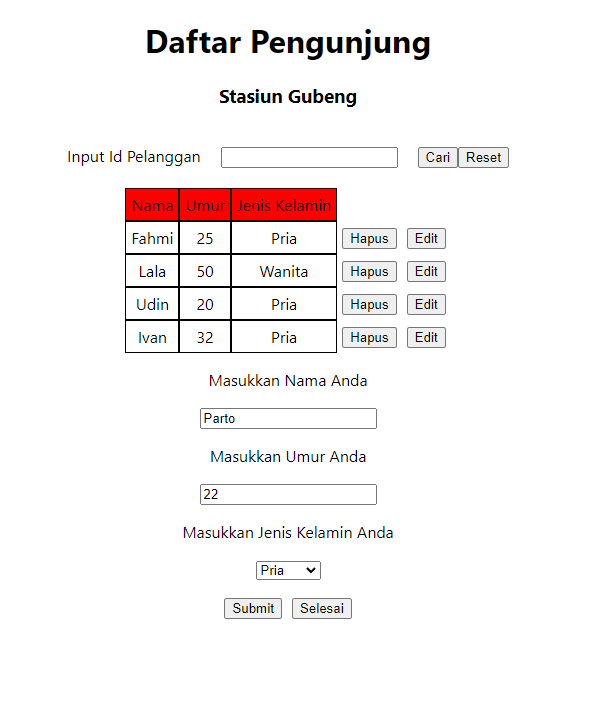
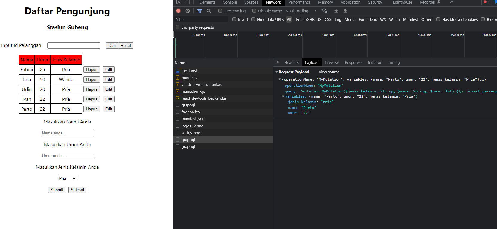
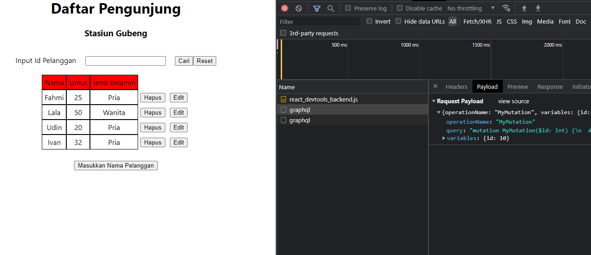
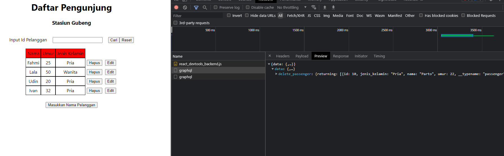
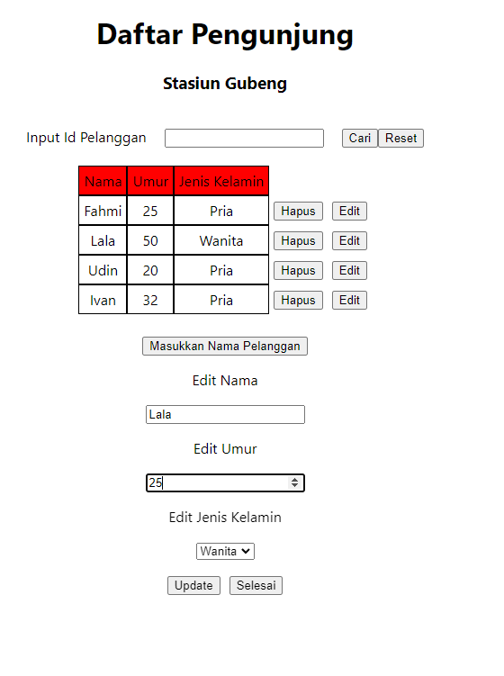
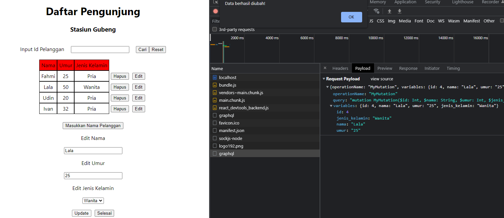
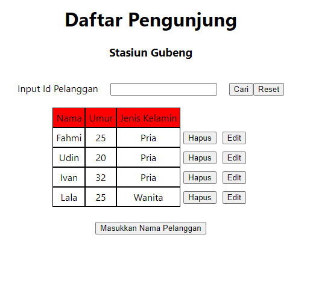

## Summary
- Mutation merupakan core feature dari GraphQL yang digunakan untuk memanipulasi data pada database (insert, update, delete).
- Hooks useMutation digunakan untuk menggunakan mutation pada React.
- Biasanya refetchQueries digunakan setelah useMutation digunakan. refetchQueries digunakan untuk mengupdate sebuah daftar yang telah dimanipulasi.

#### Hasil Assignment
**Daftar awal penumpang**

\
\
\
**Insert penumpang dengan nama Parto**

**Insert penumpang berhasil**

\
\
\
**Delete penumpang dengan nama parto**

\
\
\
**Update penumpang**

**Update penumpang berhasil**

**Daftar penumpang setelah update**
